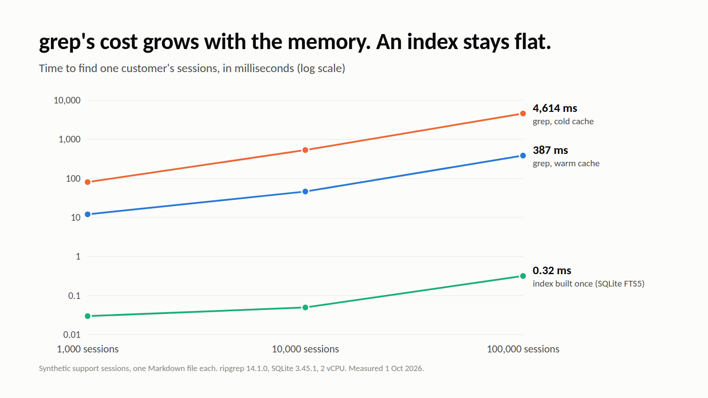

# cognee-agent-memory-experiments

What it costs to use **grep**, a **SQLite database**, or a **memory layer (Cognee)** as an AI agent's long-term memory, measured on up to 100,000 synthetic support sessions.

Everything here is reproducible with the Python standard library and ripgrep. The numbers behind two articles come from these scripts, and every figure is rendered from the committed `results.json` files.



## The headline numbers

One question, "show me everything about customer ACME-1171", asked of a memory that is a folder of Markdown files:

| sessions | corpus | `rg` one customer, warm cache | `rg`, cold cache | SQLite FTS5 index |
| ---: | ---: | ---: | ---: | ---: |
| 1,000 | 0.8 MB | 12.1 ms | 81.1 ms | 0.03 ms |
| 10,000 | 7.5 MB | 46.4 ms | 534.7 ms | 0.05 ms |
| 100,000 | 74.2 MB | 386.7 ms | 4,614.3 ms | 0.32 ms |

Searching the same 100,000 sessions for the exact words `"billing bug"` finds 63 of the 484 planted bug reports. Searching for `"invoice"` finds 427 of them, and returns 81,049 sessions (about 3 million tokens) to get there.

Measured 2026-10-01 on 2 vCPU Intel Xeon @ 2.80 GHz, ripgrep 14.1.0, SQLite 3.45.1, Python 3.11. Your machine will give different timings and the same counts.

## Quick start

Requirements: Python 3.11+ and [ripgrep](https://github.com/BurntSushi/ripgrep) (`rg`) on your PATH. Nothing to `pip install` for the first two experiments.

```bash
git clone https://github.com/yashksaini-coder/cognee-agent-memory-experiments
cd cognee-agent-memory-experiments

# 1. generate the corpora (seeded, so the planted facts are identical on every machine)
for n in 1000 10000 100000; do python experiments/grep_memory/make_corpus.py corpus/$n $n; done

# 2. grep as memory: latency, recall, tokens returned, multi-hop, stale facts, FTS5 comparison
python experiments/grep_memory/bench.py corpus 1000 10000 100000 > my_grep_results.json

# 3. a relational database as memory: keyed lookup, word overlap, lost history, schema growth
python experiments/db_memory/db_demo.py corpus/10000 > my_db_results.json

# 4. (optional) the same questions through Cognee, see GUIDE.md step 4
python experiments/cognee_demo/run_cognee_demo.py corpus/10000
```

Step by step, with what each number means and what to look for in the output: **[GUIDE.md](GUIDE.md)**.

## What is in the repo

```
experiments/
  grep_memory/
    make_corpus.py      generates N support sessions as Markdown files + a PR note + truth.json
    bench.py            times ripgrep queries, measures recall and tokens, builds an FTS5 index
    results.json        the published run at 1k, 10k and 100k sessions
  db_memory/
    db_demo.py          loads the corpus into SQLite and asks four questions an agent gets
    results.json        the published run at 10k sessions
  cognee_demo/
    run_cognee_demo.py  remember() a slice of the corpus into Cognee, recall() the same questions
figures/
  make_figures.py       renders every PNG below from the two results.json files (needs playwright)
  grep-*.png db-*.png   charts used in the articles
  m1-*.png .. m8-*.png  explainer slides used in short posts
GUIDE.md                the code-along
```

## The three experiments in one paragraph each

**grep as memory** (`bench.py`). Every query is a full scan, so cost grows with the folder. A literal query finds 13% of the bug reports because customers described one bug in 8 ways. A broad query finds 88% but returns 81% of the corpus. A connected question ("which customers did PR #4812's bug affect?") needs 4 rounds and 2 full scans, and only works because the synthetic PR note lists session IDs. A customer whose plan changed gets two contradictory answers with no dates. An FTS5 index removes the scan and nothing else.

**A database as memory** (`db_demo.py`). A keyed lookup is 0.048 ms and exact. A question with no key in it ("did the fix for ACME's billing problem ship?") has nothing to join on: 4 of the 8 complaint phrasings share no content word with the PR that fixed them, and one shares only "invoice", which is in 80.5% of sessions. An `UPDATE` to a customer's plan keeps the new value and drops the history. Eight relation types an extractor could find in this data mean eight schema decisions up front, or one generic edges table that something has to fill.

**A memory layer** (`run_cognee_demo.py`). The same slice of sessions goes through `cognee.remember()` (chunk, embed, extract entities and relations into a graph) and `cognee.recall()`. It runs keyless on CPU with local models, or with an LLM key. It is not benchmarked here; the script exists so you can measure it on your own data.

## Write-ups

- *grep as Agent Memory: What It Costs at 100,000 Sessions* (DEV)
- *"Just Use a Database": I Loaded 10,000 Agent Sessions into SQLite to Check* (DEV)

Both link back here. Links will be added once the articles are published.

## Caveats

- The corpus is synthetic. It is shaped like support data, but real conversations use even more vocabulary.
- Token counts are estimated at 4 characters per token.
- The cold-cache measurement writes to `/proc/sys/vm/drop_caches` and needs root on Linux; without it `cold_ms` is `null`.
- Timings depend on the machine. Counts (bug reports found, sessions returned, customers found) are deterministic: `make_corpus.py` uses a fixed seed.

## License

MIT. See [LICENSE](LICENSE).
