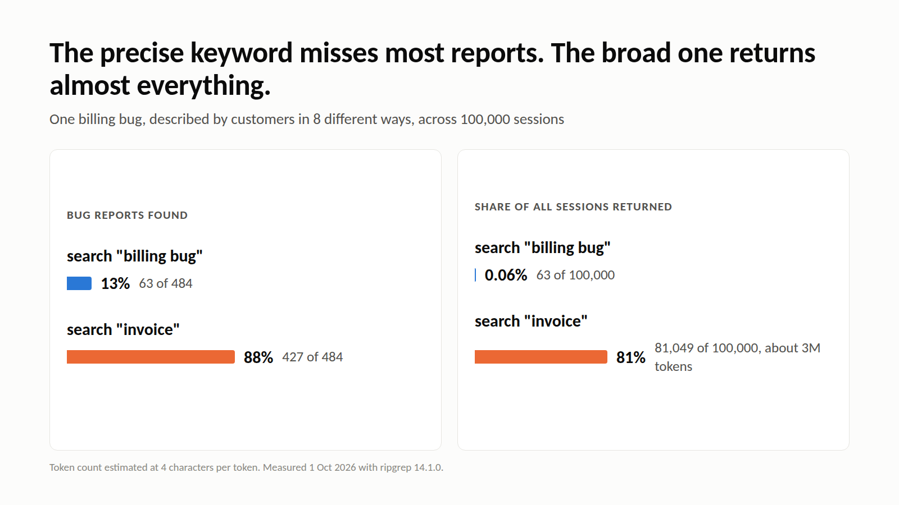

> I write for Cognee. Tested on 2026-10-01: ripgrep 14.1.0, SQLite 3.45.1, Python 3.11, 2 vCPU Intel Xeon @ 2.80 GHz, Linux. Scripts are linked at the end.

```text
sessions   corpus    rg one customer (warm)   rg (cold cache)   FTS5 index
   1,000    0.8 MB          12.1 ms                81.1 ms         0.03 ms
  10,000    7.5 MB          46.4 ms               534.7 ms         0.05 ms
 100,000   74.2 MB         386.7 ms             4,614.3 ms         0.32 ms
```

That is one question, "show me everything about customer ACME-1171", asked of an agent whose memory is a folder of Markdown files. grep reads every file on every call, so the time grows with the folder. The last column is the same lookup against an index built once at write time.


## Why grep is a fair contender

"Claude Code's 'agentic search' is really just glob and grep, and it outperformed RAG." Boris Cherny said that in [an interview with The Pragmatic Engineer](https://newsletter.pragmaticengineer.com/p/building-claude-code-with-boris-cherny). His team had tried local vector databases, and stale indexes and permission problems made them worse than plain search.

So "save every conversation to files and let the agent grep them" is a serious proposal. This article tests it on the workload agent memory actually has. It is for anyone building an agent that has to remember users across sessions and who is deciding whether a memory layer is worth the setup.

## The test corpus

I generated support-agent sessions, one Markdown file each, and stored them the way a file-based memory would: a header, then user and agent turns.

```markdown
# Session S004417
customer: GLOBEX-1042
date: 2026-03-11

**user:** can you resend last month's invoice to finance@globex-1042.example
**agent:** I've resent it, it should arrive within a few minutes.
**user:** the CSV export times out above 50k rows
...
```

Three things are planted so the answers can be checked:

- **A billing bug** that about 0.5% of sessions report, in 8 phrasings. Only one of them contains the words "billing bug". The others say "my invoice looked wrong", "our receipt dropped the extra seats" and so on.
- **A PR note** (`pr-4812.md`) written in engineering words: "fix payment sync delay dropping line items". It lists the affected session IDs and names no customer.
- **Plan changes**: some customers move plans, and both the old and the new statement stay on disk.

Corpora of 1k, 10k and 100k sessions came out at 0.8, 7.5 and 74.2 MB.

## Cost grows with the corpus, on every query

ripgrep is fast. It is still a full scan. The table at the top shows the warm-cache lookup growing about 32× from 1k to 100k sessions (12.1 ms to 386.7 ms). With a cold page cache, which is what a memory folder looks like after a restart or on a busy server, the 100k lookup took 4.6 s. The FTS5 index in the last column took 6.4 s to build, once, and answered in 0.32 ms.

Code search hits the same wall at scale. Cursor [wrote in March 2026](https://cursor.com/blog/fast-regex-search): "We routinely see `rg` invocations that take more than 15 seconds." Their fix was an index.

Memory grows faster than a codebase does. Every session adds files and nobody prunes chat logs, so whatever grep costs today, it costs more after every conversation.

## Literal search misses how people talk

The agent wants every session about the billing bug. It searches for the obvious words:

| Query | 1k | 10k | 100k |
| --- | --- | --- | --- |
| `rg -il "billing bug"`: bug reports found | 1 / 8 | 9 / 49 | 63 / 484 |
| `rg -in "invoice"`: bug reports found | 8 / 8 | 41 / 49 | 427 / 484 |
| `rg -in "invoice"`: sessions returned | 811 | 8,053 | 81,049 |
| `rg -in "invoice"`: estimated tokens returned | 29.7k | 302k | 3.0M |

The precise query finds 13% of the reports. The broad query finds 88%, but at 100k sessions it matches 81% of all files, and 0.53% of what it returns is relevant. Its output is about 3 million tokens (estimated at 4 characters per token), more than any context window holds.



This is the mistake I made first: I assumed a better keyword would fix it. It doesn't. Four of the eight phrasings share no word with "billing bug" or with the PR that fixed it. The customers said "receipt", "statement", "bill" and "charge". Exact matching needs both sides to use the same words, and conversations don't.

An index does not fix this part either. A SQLite FTS5 index over the same 100k sessions found the same 63 of 484 reports for `"billing bug"`. Indexing removes the scan, but it still matches words.

## Multi-hop questions multiply the scans

"Which customers were affected by the bug PR #4812 fixed?" takes four rounds with grep:

1. Search for `PR #4812` (a full scan).
2. Read the PR note to get the session IDs.
3. Search for those IDs (a second full scan).
4. Read the `customer:` line of each match.

At 100k sessions this took 898 ms across 2 full scans and found all 442 affected customers. That result has a catch: it only worked because my PR note lists session IDs. A real PR says "fixes the sync delay". It doesn't list which conversations the bug showed up in. Without that list there is nothing to search for in round 3, and the agent is back to guessing keywords.

## grep doesn't know what changed

```console
$ rg -N -o -I "STARK-1135 (is on|moved to) the \w+ plan" sessions
STARK-1135 moved to the starter plan
STARK-1135 is on the team plan
```

Both statements come back in file order, with no dates attached. The customer moved from team to starter on 28 Jan. To know that, the agent has to open both files, read the dates, and work it out each time someone asks.

## When grep is the right answer

Everything above is a failure case, so it is worth being precise about where grep wins outright.

- **The memory is small.** At 1,000 sessions the warm lookup is 12.1 ms and the whole corpus is 0.8 MB. Below roughly that size you are optimising something that costs nothing. A single `memory.md` the agent reads whole is simpler still.
- **Both sides use the same string.** Customer IDs, session IDs, error codes, file paths, stack frames. Round 3 of the multi-hop question worked perfectly because session IDs are exact: grep's recall on an exact token is 100%, and no embedding beats that.
- **Nothing can go stale.** There is no index to rebuild and no extraction to re-run, which is exactly why Cherny's team dropped their vector database. grep reads what is on disk right now.
- **Setup has to be zero.** No write-time pipeline, no model, no API key, no migration.

The pattern: grep is strong when the question contains the answer's literal text and the corpus is small enough to scan. It breaks when the question is phrased differently from the memory, when answering needs two hops that aren't joined by a literal string, or when the same fact was written twice at different times.

## What fixes each problem

Each failure above needs work done once, when the memory is written, rather than on every read:

| Problem | Fix at write time | Measured here? |
| --- | --- | --- |
| Full scan per query | An index | Yes: 0.32 ms vs 386.7 ms at 100k |
| Different words for the same thing | Embeddings, so "receipt dropped the seats" lands near "billing bug" | No |
| Facts that live in different files | Extracted entities and edges: session → problem → PR | No |
| Facts that change | Timestamps on facts, so a newer fact supersedes an older one | No |

That combination is what a memory layer is. In Cognee, the write side is `remember()` and the read side is `recall()`:

```python
import asyncio

import cognee


async def main():
    await cognee.remember(session_texts, dataset_name="support", node_set=["source:support"])
    results = await cognee.recall(
        "Which customers reported problems that PR #4812 fixed?",
        datasets=["support"],
    )
    for r in results:
        print(r)


asyncio.run(main())
```

`remember()` chunks and embeds the text, extracts entities and relationships into a graph, and keeps provenance. `recall()` uses vectors to find a starting point and graph edges to collect what is connected to it.

## Limits

- **The corpus is synthetic.** It is shaped like support data, but real conversations are messier and use even more vocabulary.
- **Token counts are estimates** at 4 characters per token. I couldn't download a tokenizer in my test environment.
- **The Cognee side is not measured here.** Extraction costs an LLM call per chunk, or CPU time in keyless mode, and that cost is what you pay instead of the full scan. The script below runs the same questions through Cognee so you can measure it on your own data.
- **grep is good at exact identifiers,** and fine for a memory small enough to read whole, such as a single `memory.md`. It is not the whole answer for code, though. "Which functions call `process_payment`?" is the same multi-hop question as the PR one above, and a regex answers it only where the name appears literally: not through a wrapper, an alias or an injected dependency. Cognee's [code graph pipeline](https://docs.cognee.ai/guides/code-graph) parses a repository's AST into typed nodes and edges — functions, classes, call relationships, import chains, module dependencies — so the agent traverses the call chain instead of guessing which identifier to search for.

## Run it yourself

The scripts are in [yashksaini-coder/cognee-agent-memory-experiments](https://github.com/yashksaini-coder/cognee-agent-memory-experiments):

```bash
python experiments/grep_memory/make_corpus.py corpus/100000 100000 # generate the sessions
python experiments/grep_memory/bench.py corpus 1000 10000 100000   # grep, FTS5, multi-hop, stale facts
python demos/01-cognee-vs-grep/compare.py corpus/10000             # the same four questions, grep vs Cognee
```

Cognee's [AI agent memory guide](https://www.cognee.ai/blog/fundamentals/agent-memory) covers the write and read paths in more depth.
