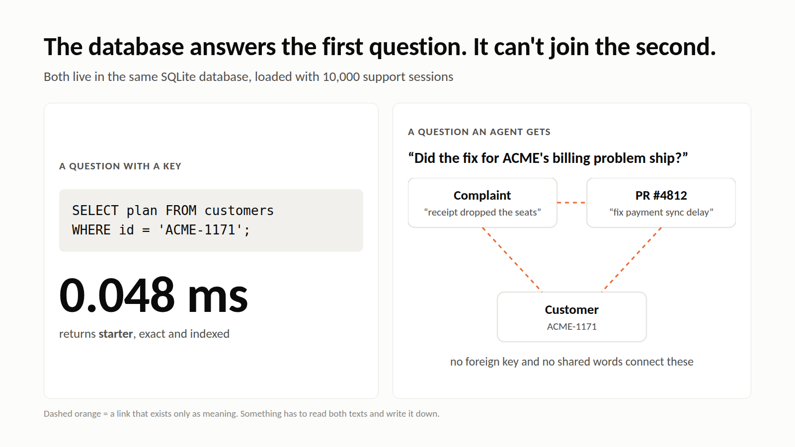
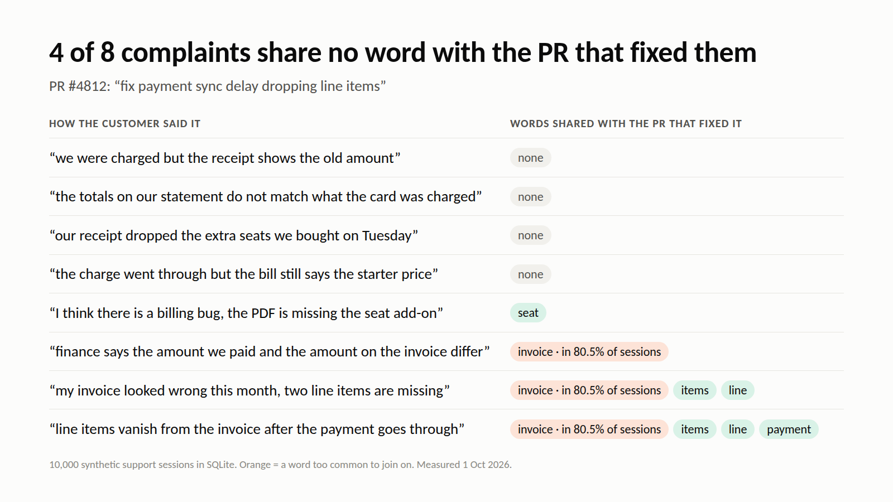
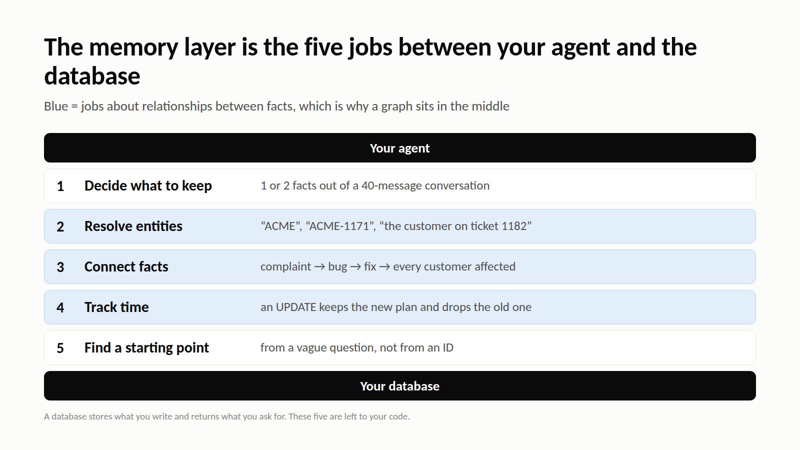

> I write for Cognee. Tested on 2026-10-01: SQLite 3.45.1, Python 3.11, Linux. Scripts are linked at the end.

```text
SELECT plan FROM customers WHERE id = 'ACME-1171';      -> starter      0.048 ms

"Did the fix for ACME-1171's billing problem ship?"     -> no key, no join, no query
```

The first line is a database doing its job. The second is the question an agent actually gets. Everything needed to answer it is in the same database, and none of it can be joined.



## The objection worth taking seriously

Every conversation about agent memory hits the same reply: just use a database. Postgres has run production systems for decades, SQLite ships with Python, and both store text fine.

The objection is half right. Cognee itself stores memory in databases: SQLite, LanceDB and a graph store by default, and it can run on a single Postgres. So the useful question isn't database or no database. It is which work the database leaves to your code.

This article is for engineers who have a database and an agent and are deciding whether they need anything in between. I loaded 10,000 support sessions into SQLite with a reasonable schema and checked four questions an agent gets every day.

## The setup

These are the same synthetic support sessions I used for [the grep article](01-grep-as-agent-memory.md): one per file, with a customer, a date and the user and agent turns. A loader script put them into three tables:

```sql
CREATE TABLE customers (id TEXT PRIMARY KEY, plan TEXT);
CREATE TABLE sessions  (id TEXT PRIMARY KEY, customer_id TEXT, day TEXT, body TEXT);
CREATE INDEX sessions_customer ON sessions(customer_id);
CREATE TABLE prs       (number INTEGER PRIMARY KEY, title TEXT, body TEXT);
```

The data contains a billing bug that 49 sessions report in 8 different phrasings, and PR #4812, which fixed it: "fix payment sync delay dropping line items".

## Keyed questions: the database wins

`SELECT plan FROM customers WHERE id = 'ACME-1171'` returns `starter` in 0.048 ms. Exact, indexed and boring, which is what you want.

If your agent's questions look like this, meaning user settings, feature flags, order status or anything with an ID in it, use a table and stop reading. A memory layer adds cost and gives you nothing here.

## Questions with no key: nothing to join on

"Did the fix for this customer's billing problem ship?" needs a link from the complaint to PR #4812. No foreign key exists, because nobody wrote one. The customer filed a complaint, and an engineer later merged a PR.

The fallback is to join on words. I checked how many content words each phrasing of the complaint shares with the PR's title and body:

| How the customer said it | Words shared with PR #4812 |
| --- | --- |
| "we were charged but the receipt shows the old amount" | none |
| "the totals on our statement do not match what the card was charged" | none |
| "our receipt dropped the extra seats we bought on Tuesday" | none |
| "the charge went through but the bill still says the starter price" | none |
| "finance says the amount we paid and the amount on the invoice differ" | invoice |
| "I think there is a billing bug, the PDF is missing the seat add-on" | seat |
| "my invoice looked wrong this month, two line items are missing" | invoice, line, items |
| "line items vanish from the invoice after the payment goes through" | invoice, line, items, payment |

Four of the eight share nothing. One shares only "invoice", which appears in 80.5% of all sessions and so connects to almost everything. Only three share a rare enough word to be useful. `LIKE '%invoice%'` joins the complaint to the PR and to 8 out of every 10 other sessions as well.



This is where I was wrong at first: I expected full-text search to close the gap. It doesn't, because the gap is vocabulary, not indexing. The link between "receipt dropped the seats" and "sync delay dropping line items" exists only as meaning. Something has to read both and write the link down.

## Facts that change: UPDATE forgets

STARK-1135 moved from the team plan to the starter plan on 28 Jan. The loader upserts plans, so the `customers` table now says `starter`. That is correct, and the history is gone. "Why did their invoice change in February?" can no longer be answered.

Keeping history means a `plan_history` table with `valid_from` and `valid_to`, and a time filter on every query that touches it. That is doable, but it is a schema decision for every fact that can change, made before you know which facts will.

## New relation types: one migration each

Here are the relation types an extractor could find in this small dataset:

- customer reported problem
- problem fixed by PR
- PR changed module
- customer on plan, with dates
- agent promised a follow-up
- engineer authored PR
- problem duplicates problem
- session mentions invoice

In a relational schema that is 8 join tables, each designed and migrated before the first row arrives. Next month's data will bring types nobody planned.

The usual way out is one generic table:

```sql
CREATE TABLE edges (src TEXT, rel TEXT, dst TEXT, valid_from TEXT, source_id TEXT);
```

That table is a graph stored in SQL. It doesn't fill itself, though. Every row needs something that reads a conversation, decides that "the receipt dropped the seats" is the same problem as PR #4812's sync delay, decides that "ACME" and "ACME-1171" are one customer, and records when each fact became true.

## Where the work actually is



| Job | Plain database | Memory layer |
| --- | --- | --- |
| Store and fetch by key | Yes | Yes (it uses a database for this) |
| Decide what in a conversation is worth keeping | Your code | Extraction at write time |
| Link facts that share no words | Your code | Entity and relation extraction into a graph |
| Merge "ACME" and "ACME-1171" | Your code | Entity resolution |
| Know which version of a fact is current | Your schema, per fact | Timestamps on facts |
| Find a starting point from a vague question | `LIKE`, or nothing | Embeddings |

In Cognee the right-hand column is two calls:

```python
import asyncio

import cognee


async def main():
    await cognee.remember(session_texts, dataset_name="support", node_set=["source:support"])
    answer = await cognee.recall(
        "Did the fix for ACME-1171's billing problem ship?",
        datasets=["support"],
    )
    print(answer)


asyncio.run(main())
```

The storage underneath is still databases: relational for provenance, vectors for meaning, and a graph for the edges. You can put all three on one Postgres instance. For the open-source graph store that is a demo feature, and the production version is licensed.

## Limits

- **Extraction isn't free.** Every `remember()` costs an LLM call per chunk, or CPU time with the keyless local models. A table insert costs neither.
- **Extraction can be wrong.** A bad edge sits in the graph looking as valid as a good one. Review what it builds on your own data before trusting it.
- **The data is synthetic,** and I haven't measured Cognee's answer to the same question here. The script below runs it so you can.
- **A memory layer is overhead** if your questions have keys. Use a table.

## Run it yourself

The scripts are in [yashksaini-coder/cognee-agent-memory-experiments](https://github.com/yashksaini-coder/cognee-agent-memory-experiments):

```bash
python experiments/grep_memory/make_corpus.py corpus/10000 10000 # the same sessions as the grep article
python experiments/db_memory/db_demo.py corpus/10000             # keyed lookup, word overlap, plan history
python demos/02-cognee-graph/build_graph.py corpus/10000         # build the graph, dump it, render graph.html
```

Cognee's [AI agent memory guide](https://www.cognee.ai/blog/fundamentals/agent-memory) walks through the write path in more depth.
