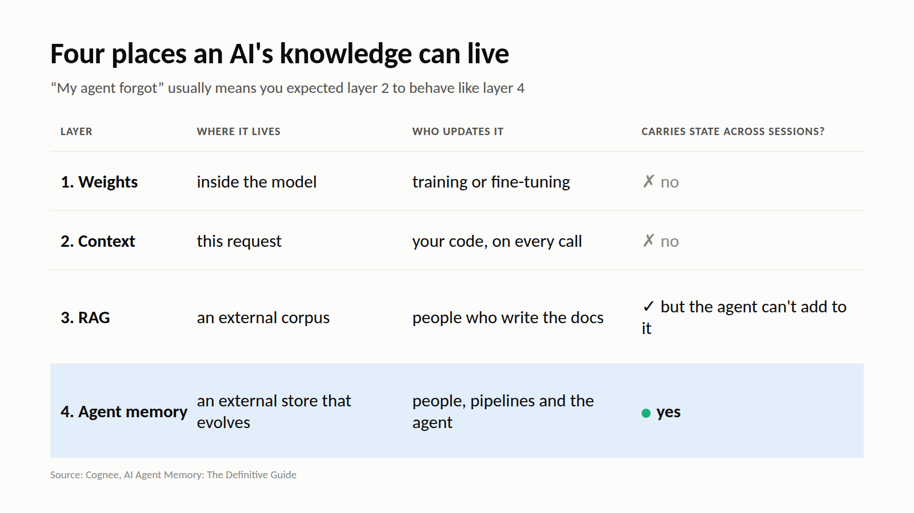

# M2: Four places an AI's knowledge can live

**For:** Cognee's LinkedIn and X. **LinkedIn length:** 122 words. **X length:** 225 characters.

## LinkedIn

"Give the model more knowledge" can mean four different things:

1. **Weights.** Training or fine-tuning. Good for general knowledge. Bad for session state, and specific facts are hard to inspect or delete.
2. **Context.** Whatever you put in this request. Flexible, but it's gone after the call and gets slower and pricier as it grows.
3. **RAG.** An external corpus that humans write. Good for grounding answers in existing docs.
4. **Agent memory.** An external store that evolves, written by humans, pipelines and the agent itself. This is what carries continuity across tasks.

Most "my agent forgot" bugs come from expecting layer 2 to behave like layer 4.

The memory is external to the model. Adding it doesn't require changing the LLM.

## X

Model knowledge lives in 4 places: weights (trained in), context (this call only), RAG (docs someone wrote), agent memory (an evolving store the agent writes to).

"My agent forgot" usually means you expected 2 to act like 4.

## Source

- [AI Agent Memory: The Definitive Guide](https://www.cognee.ai/blog/fundamentals/agent-memory), Cognee, 7 Aug 2026
