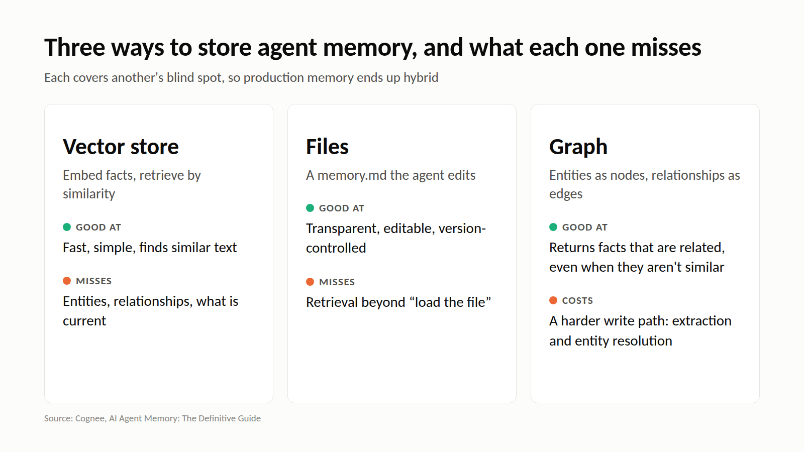

# M3: Three ways to store agent memory, and what each one misses

**For:** Cognee's LinkedIn and X. **LinkedIn length:** 144 words. **X length:** 237 characters.

## LinkedIn

There are three common ways to store agent memory, and each has a blind spot:

**Vector store.** Embed facts and retrieve by similarity. Fast and simple. But there are no entities, so lookups by a specific name, code or ID are unreliable. There are no relationships, and no notion of what is current.

**Files** (`memory.md`). Transparent, editable and version-controlled. But retrieval is "load the file" or "guess the filename", and sharing across projects is awkward.

**Graph.** Entities as nodes, typed relationships as edges. It can return entries that are logically related, even when they aren't similar. The cost is a more complex write path: extraction, entity resolution and schema choices.

Each one covers another's blind spot. That's why production memory systems tend to be hybrid: vectors to find the entry point, a graph to follow connections, and a relational store for metadata and permissions.

## X

Vector memory: similar, but no entities or relationships. File memory: transparent, but retrieval is "load it all". Graph memory: connected, but a harder write path.

Each covers another's blind spot, so production memory ends up hybrid.

## Source

- [AI Agent Memory: The Definitive Guide](https://www.cognee.ai/blog/fundamentals/agent-memory), Cognee, 7 Aug 2026
