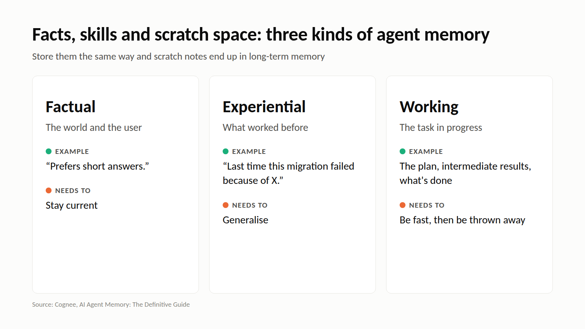

# M4: Facts, skills and scratch space

**For:** Cognee's LinkedIn and X. **LinkedIn length:** 114 words. **X length:** 192 characters.

## LinkedIn

"Agent memory" covers three different kinds of content, and they age differently:

**Factual memory**: the world and the user. "Prefers short answers." "The payments service depends on the gateway." It needs to stay current.

**Experiential memory**: what worked. Strategies, lessons, "last time this migration failed because of X." It needs to generalise.

**Working memory**: the state of the task in progress. The plan, intermediate results, what's done. It needs to be fast and can be thrown away.

Mixing them causes familiar bugs. Scratch notes leak into long-term facts. Lessons get stored as one-off events. User facts get wiped with the task buffer.

Before choosing a store, decide which of the three you are storing.

## X

Agent memory is three things: facts (keep current), experience (generalise), working state (keep fast, then throw away).

Store them the same way and you get scratch notes in long-term memory.

## Source

- [AI Agent Memory: The Definitive Guide](https://www.cognee.ai/blog/fundamentals/agent-memory), Cognee, 7 Aug 2026
