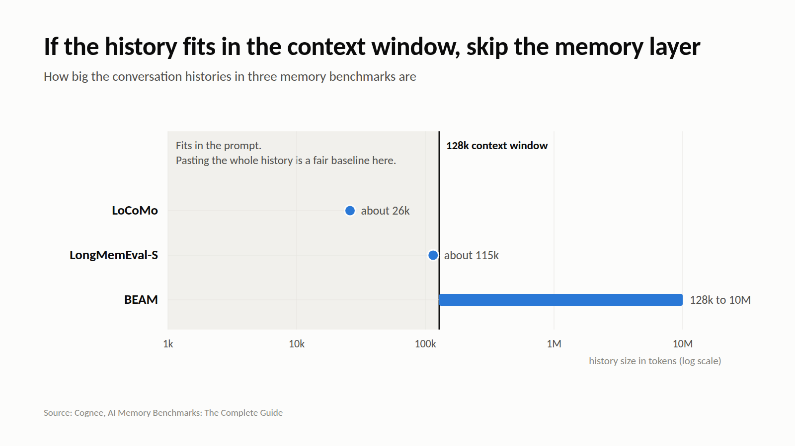

# M5: If the history fits in the context window, skip the memory layer

**For:** Cognee's LinkedIn and X. **LinkedIn length:** 125 words. **X length:** 173 characters.

## LinkedIn

An unusual thing for a memory company to say: sometimes you don't need a memory layer.

Cognee's benchmarks guide is direct about it: "If the full history fits comfortably inside the model's context window, a strong baseline is to skip the memory layer."

The size of popular memory benchmarks shows why this matters:
• DMR: a few thousand tokens
• LoCoMo: about 26k tokens per conversation
• LongMemEval-S: about 115k tokens
• BEAM: 128k up to 10M tokens

A 26k-token history fits in most current context windows. On benchmarks that size, "paste everything into the prompt" is a fair baseline, and a memory system has to beat it to justify itself.

Memory earns its cost when histories outgrow the window, or come close to it.

## X

Memory-company take: if your agent's whole history fits in context, skip the memory layer.

LoCoMo is ~26k tokens. BEAM runs to 10M. Know which one looks like your workload.

## Source

- [AI Memory Benchmarks: The Complete Guide](https://www.cognee.ai/ai-memory-benchmarks), Cognee, 1 Sep 2026
