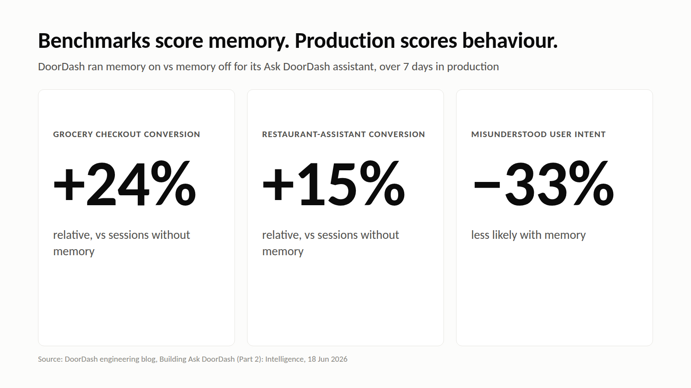

# M7: Benchmarks score memory. Production scores behaviour

**For:** Cognee's LinkedIn and X. **LinkedIn length:** 124 words. **X length:** 232 characters.

## LinkedIn

A memory system can top a benchmark and still not help your agent finish its tasks.

The benchmarks guide points to MemoryArena, which found that "systems performing well on benchmarks such as LoCoMo can still have low task-completion rates." Recall is not the same as useful recall.

The useful test is the boring one: memory on vs memory off, on your own workload.

DoorDash ran that test over a 7-day production window for its Ask DoorDash assistant and [reported](https://careersatdoordash.com/blog/building-ask-doordash-part-two-intelligence/):
• ~24% higher relative checkout conversion in grocery
• ~15% higher relative conversion on restaurant-assistant queries
• ~33% less likely to misunderstand user intent

Public benchmarks are a sanity check. The number that matters is what your agent does differently with memory than without it.

## X

Topping a memory benchmark ≠ helping your agent finish tasks.

DoorDash measured memory on vs off in production: ~24% higher grocery checkout conversion, ~33% less likely to misread intent.

Run the on/off test on your own workload.

## Source

- [AI Memory Benchmarks: The Complete Guide](https://www.cognee.ai/ai-memory-benchmarks), Cognee, 1 Sep 2026
- [Building Ask DoorDash (Part 2): Intelligence](https://careersatdoordash.com/blog/building-ask-doordash-part-two-intelligence/), DoorDash, 18 Jun 2026

----

Initially benchmarks are useless, how 
