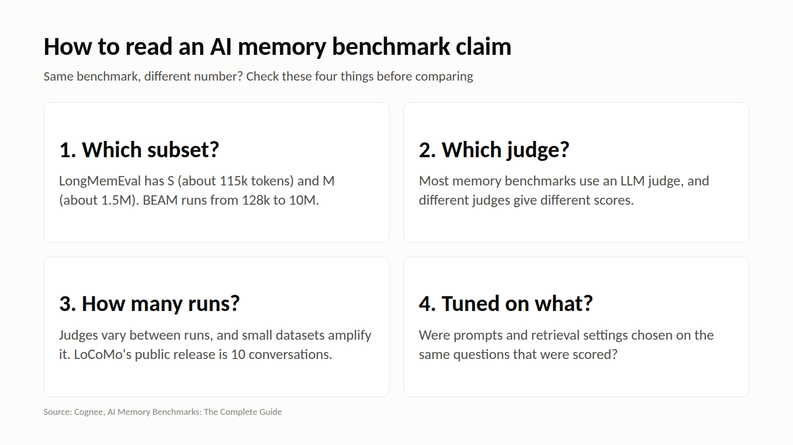

# M8: How to read an AI memory benchmark claim

**For:** Cognee's LinkedIn and X. **LinkedIn length:** 123 words. **X length:** 192 characters.

## LinkedIn

Two vendors report scores on the same benchmark. They often aren't comparable. Before you trust a number, check four things:

1. **Which subset?** LongMemEval has S (~115k tokens) and M (~1.5M) variants. BEAM has tiers from 128k to 10M.
2. **Which judge?** Most memory benchmarks use an LLM judge, and different judge models produce different scores.
3. **How many runs?** Stochastic judges vary between runs, and small datasets amplify it. LoCoMo's public release is 10 conversations.
4. **Tuned on what?** Were prompts and retrieval settings chosen on the same questions that were scored?

Cognee's own BEAM results (0.79 at 100K, 0.67 at 10M) come with a setup write-up and are described as directional. That's the bar to hold every claim to, including ours.

## X

Same benchmark, different number? Check the subset (LongMemEval S vs M), the judge model, the number of runs, and whether settings were tuned on the scored questions.

No setup, no comparison.

## Source

- [AI Memory Benchmarks: The Complete Guide](https://www.cognee.ai/ai-memory-benchmarks), Cognee, 1 Sep 2026
