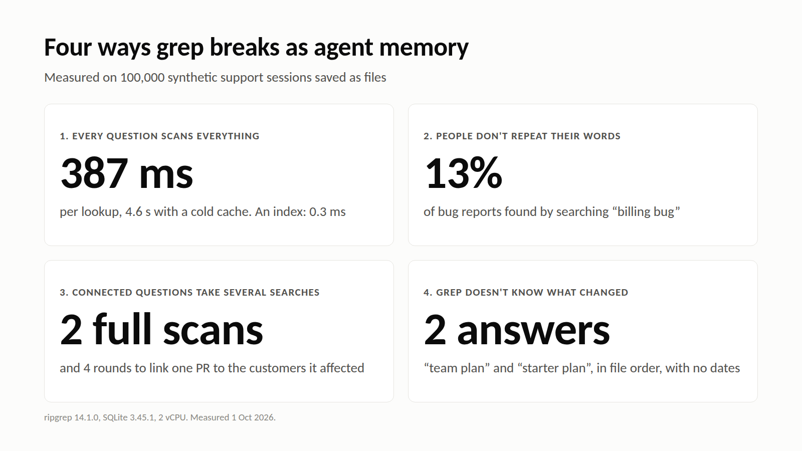

# Post: Why grep is expensive as agent memory

**For:** Cognee's LinkedIn and X, in the Post 2 format. Veljko asked for this on 29 Sep: "Why is grep expensive and why it cannot scale for your agentic memory".
**Target phrase:** grep for AI agent memory. **Length:** 443 words.
**No disclosure line:** Cognee publishes this from its own accounts.

## Post

"Claude Code's 'agentic search' is really just glob and grep, and it outperformed RAG." That's Boris Cherny, who created Claude Code.

He's right about code. So why not do the same for agent memory: save every conversation to a folder and let the agent grep it?

We tried it on 100,000 synthetic support sessions. grep breaks down in four ways.

### 1. Every question scans everything

grep keeps no index, so every query reads every file. In our test, looking up one customer took:

- 12 ms at 1,000 sessions
- 46 ms at 10,000
- 387 ms at 100,000, and 4.6 s with a cold disk cache

The same lookup against an index built once took 0.3 ms.

Memory only grows. Every conversation adds files, so the cost of every future question goes up with it. Cursor hit the same wall with code: they "routinely see `rg` invocations that take more than 15 seconds", and their fix was an index.

### 2. People don't repeat their own words

Customers reported one billing bug in 8 different ways: "receipt dropped the seats", "statement doesn't match the charge", and so on. Searching for "billing bug" found 63 of 484 reports, about 13%.

Searching for "invoice" found 88% of them, but it matched 81% of all sessions and returned an estimated 3 million tokens. That's more than any context window holds.

Code has exact identifiers. Conversations don't.

### 3. Connected questions take several searches

"Which customers were affected by the bug PR #4812 fixed?" took 4 rounds and 2 full scans. Even that worked only because our PR note listed the session IDs. A real PR says "fix sync delay" and nothing more, which leaves the agent nothing to search for.

### 4. grep doesn't know what changed

Ask for one customer's plan and grep returns both "is on the team plan" and "moved to the starter plan", in file order, with no dates. The agent has to work out which one is current every single time.

### The fix: do the work once, at write time

- **An index** removes the full scan.
- **Embeddings** match "receipt dropped the seats" to "billing bug".
- **Graph edges** link the complaint to the fix to the customers.
- **Timestamps** tell the current fact from the old one.

That combination is a memory layer. In Cognee it's `remember()` on the way in and `recall()` on the way out, so a question never has to rescan the whole history.

grep is still the right tool for a codebase, or for a memory small enough to read whole. Past that, you pay for the full scan on every question.

## X thread

1/ Claude Code's search is "just glob and grep, and it outperformed RAG." So why not grep your agent's memory? We tested it on 100k support sessions.

2/ One customer lookup: 12 ms at 1k sessions, 387 ms at 100k, 4.6 s with a cold cache. An index built once: 0.3 ms. Memory only grows.

3/ Customers described one bug 8 ways. Searching "billing bug" found 13% of the reports. Searching "invoice" matched 81% of all sessions, about 3M tokens.

4/ grep also can't link a complaint to its fix, and it can't tell an old fact from the current one. Do that work once at write time: an index, embeddings, graph edges and timestamps.
